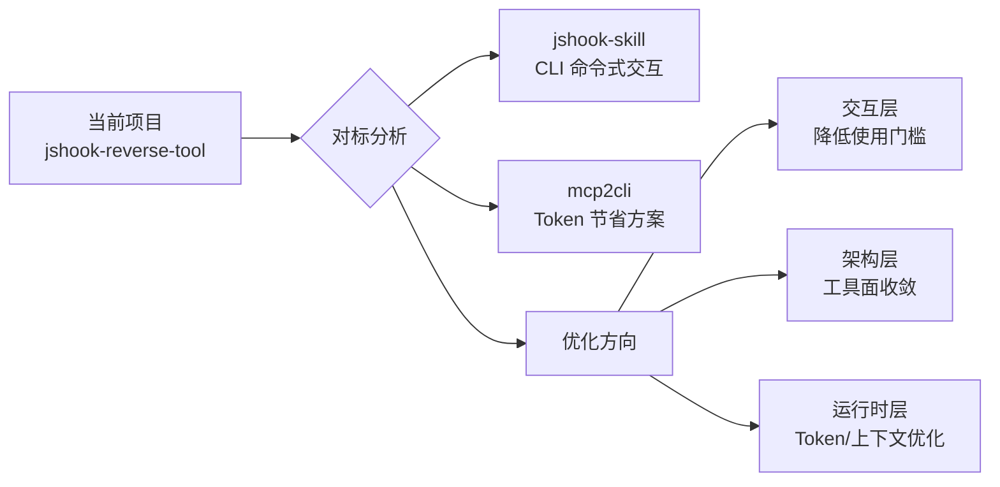
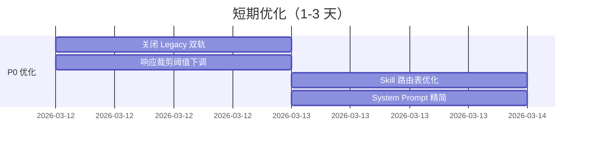

# JSHook Reverse Tool 系统化优化方案

> 基于 `jshook-skill`、`mcp2cli` 对比分析，面向当前项目的可落地优化路线

---

## 一、优化目标概览



### 三个项目定位对比

| 维度 | **当前项目** (jshook-reverse-tool) | **jshook-skill** | **mcp2cli** |
|------|------|------|------|
| **定位** | MCP Server（全功能逆向工具集） | Claude Code Skill（纯命令式交互） | MCP → CLI 转换器 |
| **工具暴露** | MCP tools（V2 分组 + Legacy 平铺） | CLI 命令 + SkillRouter 分发 | CLI subcommands |
| **交互方式** | Agent 通过 MCP 调用 JSON schema tools | 用户直接输入 `/命令 参数` | Agent 通过 shell 调用 CLI |
| **Token 开销** | 高（~27 个 V2 tools + 80+ Legacy tools 的 JSON schema 全量注入） | 低（Skill prompt 文本，按需） | 极低（仅 ~67 tokens/turn 的系统提示） |
| **能力深度** | 深（session/artifact/evidence 链、多引擎、Worker 池） | 中（专注核心逆向操作，无会话管理） | 无（纯代理层，不提供能力） |

---

## 二、可借鉴 `jshook-skill` 的设计点

### 2.1 当前项目已有、但封装不够友好的能力

| jshook-skill 命令 | 当前项目对应能力 | 差距分析 |
|---|---|---|
| `collect <url>` | `flow.collect-site` | ✅ 功能完整，但参数更复杂（需传 `collectionStrategy`、`budgets` 等） |
| `search "keyword"` | `inspect.scripts(action: "search")` | ⚠️ 功能更强（支持 worker 搜索、分页），但 action enum 增加认知成本 |
| `debugger enable/disable` | `debug.control(action: "enable")` | ⚠️ 封装为 action enum，不如直接命令直觉 |
| `breakpoint set-url` | `debug.breakpoint` | ✅ 功能等价 |
| `hook generate function X` | `hook.generate(description: "...")` | ✅ 当前项目更强（AI 生成 + RAG 模板） |
| `stealth inject` | 当前项目通过 `flow.collect-site` 内置 stealth | ⚠️ 不如独立命令灵活，但自动化程度更高 |
| `dom query/structure` | `inspect.dom(action: "query/structure")` | ⚠️ 功能等价，但 action enum 不如独立命令清晰 |
| `page navigate/click/type` | `browser.navigate` + `inspect.dom` | ⚠️ 当前项目 page 操作分散在多个工具中 |

**结论**：当前项目**能力覆盖全面**，核心差距在于**交互层的直觉性**——jshook-skill 用"一个命令 = 一个动作"，当前项目用"一个工具 + action enum = 多个动作"。

### 2.2 当前项目缺失、值得新增的设计

| jshook-skill 设计 | 价值评估 | 建议 |
|---|---|---|
| **Watch 表达式管理** (`watch add/list/evaluate`) | 🟢 高价值 — 动态分析时持续监控变量是刚需 | 新增 `debug.watch` 工具 |
| **XHR 断点** (`xhr-breakpoint set */api/*`) | 🟢 高价值 — 快速定位 API 签名入口 | 新增 `debug.xhr-breakpoint` 或合并到 `debug.breakpoint` |
| **Event 断点** (`event-breakpoint set click`) | 🟡 中价值 — 特定场景有用 | 可合并到 `debug.breakpoint` 的 `type` 参数 |
| **Blackbox** (`blackbox set *jquery*.js`) | 🟢 高价值 — 过滤噪音脚本是逆向刚需 | 新增 `debug.blackbox` 工具 |
| **统一命令式入口** | 🟢 极高价值 — 降低使用门槛 | 在 Skill 层而非 MCP server 层实现 |
| **标准逆向工作流** (7 步模板) | 🟡 中价值 — 当前 `flow.*` 已部分覆盖 | 在 Skill playbook 中补充完整模板 |
| **Script 管理** (`script list/find/search`) | 🟡 当前已有等价能力 | `inspect.scripts` 已覆盖 |

### 2.3 应谨慎借鉴的设计

| jshook-skill 设计 | 为什么不适合直接搬 |
|---|---|
| **纯 CLI 命令路由** (`SkillRouter.ts` 单文件分发) | 当前项目是 MCP Server 架构，工具暴露由 MCP 协议约束；命令路由应放在 Skill prompt / Workflow 层，而非 Server 层 |
| **无会话管理** | 当前项目的 session/artifact/evidence 链是核心优势，不应放弃 |
| **代码直接嵌入到命令** (如 `deobfuscate <code>`) | 大段代码作为 CLI 参数不适合 MCP 场景；当前的 `scriptId` / `chunkRef` 引用机制更健壮 |
| **无 Worker 池** | 当前项目的 Worker 池并行分析是性能优势，不应退化 |

---

## 三、当前项目最值得做的优化项

### 3.1 高影响改动清单（按优先级排序）

---

#### P0-1：工具面收敛 — 消除 Legacy/V2 双轨

| 维度 | 说明 |
|---|---|
| **要改什么** | 默认禁用 Legacy tools（[MCPServer.ts](file:///e:/work/jshook-reverse-tool-main/src/server/MCPServer.ts) 的 80+ 平铺工具），仅保留 V2 tools |
| **为什么重要** | **这是降低 Token 开销最立竿见影的手段**。Legacy 80+ 工具的 JSON schema 每轮注入消耗约 **9,000-12,000 tokens**；V2 27 个工具约消耗 **3,500-4,500 tokens**。双轨同时暴露 = 每轮 **15,000+ tokens** 浪费在工具描述上 |
| **影响模块** | [MCPServer.ts](file:///e:/work/jshook-reverse-tool-main/src/server/MCPServer.ts), [V2MCPServer.ts](file:///e:/work/jshook-reverse-tool-main/src/server/V2MCPServer.ts), [.env](file:///e:/work/jshook-reverse-tool-main/.env) 配置 |
| **改动范围** | 架构层 |
| **实施难度** | 🟢 低 — 环境变量 `ENABLE_LEGACY_TOOLS=false` 已有，只需改默认值 |
| **风险** | 低 — 已有 V2 工具覆盖所有 Legacy 能力 |
| **预期收益** | 每轮减少 **9,000-12,000 tokens**；20 轮会话节省 **180,000-240,000 tokens** |

---

#### P0-2：响应裁剪与外置化加强

| 维度 | 说明 |
|---|---|
| **要改什么** | 对 `inspect.scripts(action:"source")`、`inspect.network`、`inspect.dom` 等工具的返回值强制执行字节上限 + 摘要模式 |
| **为什么重要** | 当前 `maybeExternalize` 机制已有但阈值偏高。一次 `inspect.scripts(action:"source")` 可能返回 **100KB+ 的脚本源码**，直接注入上下文 |
| **影响模块** | [response.ts](file:///e:/work/jshook-reverse-tool-main/src/server/v2/response.ts), 各 V2 tool handler |
| **改动范围** | 运行时层 |
| **实施难度** | 🟢 低 — 调低 `maybeExternalize` 阈值 + 默认返回摘要 |
| **风险** | 低 — Agent 可通过 `inspect.artifact` 获取完整数据 |
| **预期收益** | 单次工具调用返回从平均 **5-50KB** 降至 **1-3KB**；显著减少上下文膨胀 |

---

#### P0-3：Skill Prompt 优化 — 工作流优先路由

| 维度 | 说明 |
|---|---|
| **要改什么** | 重写 [SKILL.md](file:///e:/work/jshook-reverse-tool-main/skills/jshook-reverse-operator/SKILL.md) 和 `references/tool-routing.md`，加入"场景 → 工具"直接映射表，减少 Agent 选择工具时的认知成本 |
| **为什么重要** | 当前 Skill 只有模糊的决策树（"request path focus → `flow.trace-request`"），Agent 仍需读取 27 个工具的 schema 来选择。提供精确的场景路由表 + 示例调用，可大幅减少多余的工具探索 |
| **影响模块** | [skills/jshook-reverse-operator/SKILL.md](file:///e:/work/jshook-reverse-tool-main/skills/jshook-reverse-operator/SKILL.md), `references/tool-routing.md`, `references/playbooks.md` |
| **改动范围** | 交互层 |
| **实施难度** | 🟢 低 — 纯文档修改 |
| **风险** | 极低 |
| **预期收益** | 减少 Agent 平均工具调用次数 **30-50%**（少走弯路），间接降低 Token 消耗 |

---

#### P1-1：按场景动态加载工具

| 维度 | 说明 |
|---|---|
| **要改什么** | 利用 MCP 协议的 `tools/list` 动态性，根据会话状态只返回当前阶段需要的工具子集 |
| **为什么重要** | Agent 并不需要同时看到所有 27 个工具。在"未建立 session"阶段只需看到 `browser.launch` + `flow.collect-site`；在"已有 session"阶段按 siteProfile 过滤工具 |
| **影响模块** | [V2MCPServer.ts](file:///e:/work/jshook-reverse-tool-main/src/server/V2MCPServer.ts), [ToolRegistry.ts](file:///e:/work/jshook-reverse-tool-main/src/server/v2/ToolRegistry.ts) |
| **改动范围** | 架构层 |
| **实施难度** | 🟡 中 — 需修改 `ListToolsRequestSchema` handler 增加上下文感知 |
| **风险** | 中 — 某些 MCP 客户端可能缓存工具列表，不支持动态变化 |
| **预期收益** | 每轮工具描述从 27 个（~4,000 tokens）降至 5-10 个（~1,500 tokens） |

---

#### P1-2：核心工具的 "前台命令别名层"

| 维度 | 说明 |
|---|---|
| **要改什么** | 在 Skill playbook 中，为高频操作建立"一句话命令 → 精确工具调用"的映射，类似 jshook-skill 的命令式体验 |
| **为什么重要** | jshook-skill 的核心优势不在于底层能力，而在于**"用户说一句话就能执行"**。通过在 Skill 层建立别名映射，当前项目也能获得相同体验 |
| **影响模块** | [skills/jshook-reverse-operator/references/playbooks.md](file:///e:/work/jshook-reverse-tool-main/skills/jshook-reverse-operator/references/playbooks.md) |
| **改动范围** | 交互层 |
| **实施难度** | 🟢 低 — Skill playbook 中定义命令别名表 |
| **风险** | 极低 |
| **预期收益** | 用户可以说"搜索 encrypt"，Agent 直接知道调用 `inspect.scripts(action:"search", keyword:"encrypt")`，不再需要在 27 个工具中搜索 |

**示例别名表**（可嵌入 playbook）：

```
| 用户说              | 映射到                                                       |
|---------------------|--------------------------------------------------------------|
| "打开/收集 URL"     | flow.collect-site(url: URL)                                 |
| "搜索 keyword"      | inspect.scripts(action: "search", keyword: keyword)          |
| "看脚本列表"        | inspect.scripts(action: "list")                              |
| "取脚本源码 X"      | inspect.scripts(action: "source", scriptId: X)              |
| "启用调试"          | debug.control(action: "enable")                              |
| "设断点 URL:line"   | debug.breakpoint(action: "set", url: URL, line: line)       |
| "注入 stealth"      | hook.inject(code: StealthScripts2025.getPreset("default"))  |
| "生成 Hook 描述"    | flow.generate-hook(description: 描述, autoInject: true)     |
| "看 Hook 数据"      | hook.data(hookId: ID)                                        |
| "生成报告"          | flow.reverse-report(focus: "overview")                       |
```

---

#### P1-3：新增 Watch / XHR-Breakpoint / Blackbox 能力

| 维度 | 说明 |
|---|---|
| **要改什么** | 在 V2 工具中新增 `debug.watch`、`debug.xhr-breakpoint`、`debug.blackbox` 三个工具 |
| **为什么重要** | 这是 jshook-skill 相对当前项目的**真实功能差距**（不仅是交互差距）。Watch 表达式、XHR 断点、黑盒化是动态逆向分析的核心能力 |
| **影响模块** | [createV2Tools.ts](file:///e:/work/jshook-reverse-tool-main/src/server/v2/tools/createV2Tools.ts), 底层模块 `WatchExpressionManager.ts`、`XHRBreakpointManager.ts`、`BlackboxManager.ts` |
| **改动范围** | 工具层 + 运行时层 |
| **实施难度** | 🟡 中 — 底层模块（如 `DebuggerManager.ts`）已有 CDP 调用基础，需在 V2 tool 层暴露 |
| **风险** | 低 — 底层能力已存在于 Legacy 工具中 |
| **预期收益** | 补齐动态分析闭环，使 Agent 可以完成完整逆向工作流 |

---

#### P2-1：新手/专家模式分层暴露

| 维度 | 说明 |
|---|---|
| **要改什么** | 通过 [.env](file:///e:/work/jshook-reverse-tool-main/.env) 配置或 Skill 参数支持两种模式：新手模式仅暴露 `flow.*` + `browser.launch/close/navigate`（~10 工具）；专家模式暴露全部（~27 工具） |
| **为什么重要** | 大多数场景只需要 `flow.*` 工作流工具就能完成 80% 的逆向任务 |
| **影响模块** | [V2MCPServer.ts](file:///e:/work/jshook-reverse-tool-main/src/server/V2MCPServer.ts), [SKILL.md](file:///e:/work/jshook-reverse-tool-main/skills/jshook-reverse-operator/SKILL.md) |
| **改动范围** | 架构层 |
| **实施难度** | 🟢 低 |
| **风险** | 极低 |
| **预期收益** | 新手模式下工具描述 Token 降至 **~1,500 tokens/turn** |

---

#### P2-2：逆向任务模板系统

| 维度 | 说明 |
|---|---|
| **要改什么** | 在 Skill playbook 中新增"场景模板"，如："分析抖音 X-Bogus"、"分析淘宝 MTOP"、"通用 API 签名逆向"等 |
| **为什么重要** | 减少重复工作；新用户可以直接照着模板走 |
| **影响模块** | `skills/*/references/playbooks.md` |
| **改动范围** | 交互层 |
| **实施难度** | 🟢 低 — 纯文档 |
| **风险** | 极低 |
| **预期收益** | 提升新用户上手效率 |

---

#### P2-3：[createV2Tools.ts](file:///e:/work/jshook-reverse-tool-main/src/server/v2/tools/createV2Tools.ts) 文件拆分

| 维度 | 说明 |
|---|---|
| **要改什么** | 把 1850 行的 [createV2Tools.ts](file:///e:/work/jshook-reverse-tool-main/src/server/v2/tools/createV2Tools.ts) 按 group 拆分为 `browser-tools.ts`、`inspect-tools.ts`、`debug-tools.ts`、`analyze-tools.ts`、`hook-tools.ts`、`flow-tools.ts` |
| **为什么重要** | 代码可维护性；便于按场景动态加载 |
| **影响模块** | `src/server/v2/tools/` |
| **改动范围** | 架构层 |
| **实施难度** | 🟢 低 — 纯重构 |
| **风险** | 低 |
| **预期收益** | 代码可维护性提升 |

---

### 3.2 优化对比矩阵

| 优化项 | 影响面 | 收益 | 难度 | 层级 |
|---|---|---|---|---|
| P0-1 关闭 Legacy 双轨 | 🔴🔴🔴 极高 | 每轮省 9K-12K tokens | 🟢 低 | 架构 |
| P0-2 响应裁剪 | 🔴🔴🔴 极高 | 单次省 5-50KB | 🟢 低 | 运行时 |
| P0-3 Skill 路由优化 | 🔴🔴 高 | 减少 30-50% 无效调用 | 🟢 低 | 交互 |
| P1-1 工具动态加载 | 🔴🔴 高 | 每轮省 2K-3K tokens | 🟡 中 | 架构 |
| P1-2 命令别名层 | 🟡🟡 中 | 提升交互效率 | 🟢 低 | 交互 |
| P1-3 Watch/XHR/Blackbox | 🟡🟡 中 | 补齐功能缺口 | 🟡 中 | 工具 |
| P2-1 新手/专家分层 | 🟡 中 | 新手省 2K tokens | 🟢 低 | 架构 |
| P2-2 逆向任务模板 | 🟡 中 | 提升上手效率 | 🟢 低 | 交互 |
| P2-3 文件拆分 | 🟢 低 | 可维护性 | 🟢 低 | 架构 |

---

## 四、Token / 上下文消耗问题分析

### 4.1 当前项目 Token 消耗构成

```
┌──────────────────────────────────────────────────────────────┐
│            每轮 Token 消耗估算（当前状态）                     │
├────────────────────────────┬─────────────────────────────────┤
│ 来源                       │ 估算 Token 数                    │
├────────────────────────────┼─────────────────────────────────┤
│ V2 Tools schema (27 个)    │ ~4,000 - 4,500                  │
│ Legacy Tools schema (80+)  │ ~9,000 - 12,000                 │
│ System prompt (jshook)     │ ~3,000 - 5,000                  │
│ Skill prompt               │ ~800 - 1,200                    │
│ 单次工具返回（平均）        │ ~2,000 - 50,000                 │
├────────────────────────────┼─────────────────────────────────┤
│ 每轮总计（保守估算）        │ ~19,000 - 73,000                │
│ 20 轮会话总计               │ ~380,000 - 1,460,000            │
└────────────────────────────┴─────────────────────────────────┘
```

### 4.2 消耗过大的六个根因

#### ① 工具数量过多导致 schema 膨胀

当前 V2 (27) + Legacy (80+) = **107+ 个工具**，其 JSON schema 每轮注入系统提示。即使只看 V2 的 27 个工具，每个工具平均 ~150 tokens 的 schema，也有 ~4,000 tokens/turn。

#### ② 返回结果过大

- `inspect.scripts(action:"source")` 可返回整个脚本源码（几十 KB 到几百 KB）
- `inspect.network` 可返回大量请求详情
- `inspect.dom(action:"structure")` 可返回大型 DOM 树

当前 `maybeExternalize` 阈值偏高，大量数据直接注入上下文。

#### ③ Legacy + V2 双轨认知负担

Agent 看到 107+ 个工具名时，需要更多思考步骤来选择正确工具。这导致：
- 更多的"尝试 → 失败 → 换工具"循环
- 每轮思考过程的 Token 更多

#### ④ 大型 System Prompt

`jshook-reverse-system-prompt-2025.md` 有 **37KB**，`jshook-system-prompt-v3.md` 有 7.5KB。这些每轮都注入上下文。

#### ⑤ 工具面过宽、Agent 选择成本高

当前 27 个 V2 工具涵盖 6 个 group（browser/inspect/debug/analyze/hook/flow），Agent 每次需在所有工具中搜索，不如 jshook-skill 的"命令 = 动作"直觉映射。

#### ⑥ 重复信息注入

多次调用 `inspect.scripts(action:"list")` 会重复返回相同的脚本元数据。缺乏"只返回增量变化"的机制。

### 4.3 优化建议矩阵

| 策略 | 方法 | 预期节省 | 实施难度 |
|---|---|---|---|
| **工具面收敛** | 关闭 Legacy，只保留 V2 | ~9K-12K tokens/turn | 🟢 一行配置 |
| **分层暴露** | 新手模式 10 工具 / 专家模式 27 工具 | ~2K-3K tokens/turn | 🟢 低 |
| **按场景加载** | 动态 `tools/list` 只返回当前阶段工具 | ~2K-3K tokens/turn | 🟡 中 |
| **响应裁剪** | 降低 externalize 阈值，默认返回摘要 | ~5-50KB/次 | 🟢 低 |
| **响应分页** | 现有 `paginateItems` 机制已支持，需设更小默认 pageSize | 变量 | 🟢 低 |
| **工作流优先** | Skill playbook 引导 Agent 走 `flow.*` 而非原子工具 | 减少 30-50% 调用 | 🟢 低 |
| **系统提示精简** | 压缩 37KB 系统提示到核心信息 | ~3K-5K tokens/turn | 🟡 中 |
| **会话缓存复用** | `inspect.artifact` / `inspect.evidence` 引用之前的结果 | 避免重复查询 | 🟢 已有 |
| **增量模式** | `inspect.scripts` 返回"上次以来的新脚本" | 减少重复数据 | 🟡 中 |

---

## 五、`mcp2cli` 的适配性分析

### 5.1 `mcp2cli` 核心作用

`mcp2cli` 把任意 MCP Server 的工具暴露为 CLI 子命令（`mcp2cli --mcp <url> <subcommand> --flags`），让 LLM 通过 shell 调用而非 MCP 协议调用工具。

**核心价值**：将每轮的工具 schema 注入成本从 **~121 tokens/tool/turn** 降为 **~67 tokens/turn** 固定成本 + 按需 `--list`/`--help` 的一次性成本。

### 5.2 Token 节省机制

```
原生 MCP 模式（当前）：
  系统提示: "你有 27 个工具: [4,000 tokens 的 JSON schemas]"
  → 每轮 4,000 tokens，无论是否使用
  → 10 轮 = 40,000 tokens

mcp2cli 模式：
  系统提示: "用 mcp2cli --mcp-stdio <cmd> <subcommand> [--flags]" (67 tokens/turn)
  → mcp2cli --mcp-stdio <cmd> --list (464 tokens, 一次)
  → mcp2cli --mcp-stdio <cmd> flow.collect-site --help (120 tokens, 每个工具一次)
  → mcp2cli --mcp-stdio <cmd> flow.collect-site --url "..." (0 额外 tokens)
  → 10 轮, 用 4 个工具 = 1,734 tokens

节省率: ~95.7%
```

### 5.3 适用性评估

| 维度 | 评估 | 说明 |
|---|---|---|
| **能缓解的** | ✅ 工具 schema 每轮注入的 Token 开销 | 从 ~4,000/turn 降至 ~67/turn |
| **能缓解的** | ✅ Agent 工具选择认知成本 | `--list` 返回精简摘要而非完整 schema |
| **能缓解的** | ✅ 多 MCP Server 的叠加问题 | 多个 Server 的工具不再全量注入 |
| **不能解决的** | ❌ 工具返回值过大的问题 | CLI 输出仍然进入上下文 |
| **不能解决的** | ❌ 系统提示过大的问题 | 独立于工具暴露方式 |
| **不能解决的** | ❌ 底层能力缺失的问题 | mcp2cli 是纯代理层 |
| **不能解决的** | ❌ Legacy/V2 双轨的架构问题 | 只改变暴露方式 |

### 5.4 引入方案

> [!IMPORTANT]
> `mcp2cli` 最适合的场景是：**当前项目已经在 MCP 模式下运行，但需要在另一个 Agent（如 Claude Code、Cursor）中以低 Token 成本调用**。

**推荐集成方式**：作为**外部调用层**，不侵入当前项目代码。

```bash
# 在 Claude Code 的 .claude.json 或 Skill 中配置：
# 而非注册 27 个 MCP tools，只注册一个 shell 工具

# Agent 调用方式：
mcp2cli --mcp-stdio "npx jshook-reverse-tool" --list
mcp2cli --mcp-stdio "npx jshook-reverse-tool" flow.collect-site --url "https://target.com"
mcp2cli --mcp-stdio "npx jshook-reverse-tool" inspect.scripts --action search --keyword "encrypt"
```

### 5.5 `mcp2cli` 集成 vs 本项目内部优化对比

| 手段 | Token 节省 | 实施成本 | 适用范围 | 推荐 |
|---|---|---|---|---|
| 关闭 Legacy 双轨 | ~9K/turn | 🟢 极低 | 所有 MCP 客户端 | ✅ **立即做** |
| 响应裁剪 | ~5-50KB/次 | 🟢 低 | 所有客户端 | ✅ **立即做** |
| Skill 路由优化 | 间接省 30-50% 调用 | 🟢 低 | Claude Code | ✅ **立即做** |
| mcp2cli 接入 | ~95% schema tokens | 🟡 中 | 需要 shell 的 Agent | ⚠️ **中期考虑** |
| 动态工具加载 | ~2-3K/turn | 🟡 中 | 支持动态列表的客户端 | ⚠️ **中期考虑** |

**结论**：`mcp2cli` 值得在特定场景下引入（多 Server 联合使用、非 Anthropic 的 Agent），但**不是解决当前问题的最优先手段**。关闭 Legacy + 响应裁剪 + Skill 优化的组合效果更好、成本更低。

### 5.6 替代方案

如果不引入 `mcp2cli`，可以通过以下方式达到类似效果：

1. **Anthropic Tool Search** (`defer_loading: true`)：如果使用 Claude API，可让工具延迟加载。节省 ~85% schema tokens
2. **本项目内建按场景加载**（P1-1）：修改 `ListToolsRequestSchema` handler，根据 session 状态动态过滤工具列表
3. **Skill playbook 路由**（P0-3 + P1-2）：通过 Skill 层引导 Agent 只使用小子集工具，间接减少无效调用

---

## 六、推荐实施路线图

### 短期（1-3 天）— 快速改



| 编号 | 任务 | 改动文件 | 预估工时 |
|---|---|---|---|
| S1 | `.env` 中 `ENABLE_LEGACY_TOOLS` 默认改为 `false` | `.env.example`, `.env` | 5 分钟 |
| S2 | `response.ts` 中 `maybeExternalize` 阈值从当前值降至 4KB | `response.ts` | 30 分钟 |
| S3 | 重写 `SKILL.md` 加入场景→工具直接映射表 | `SKILL.md`, `references/tool-routing.md` | 2 小时 |
| S4 | 精简 `jshook-reverse-system-prompt-2025.md` 从 37KB 到 10KB | `jshook-reverse-system-prompt-2025.md` | 3 小时 |

### 中期（1-2 周）— 结构优化

| 编号 | 任务 | 改动文件 | 预估工时 |
|---|---|---|---|
| M1 | 新增 `debug.watch` / `debug.xhr-breakpoint` / `debug.blackbox` V2 工具 | `createV2Tools.ts` (或拆分后的文件) | 2 天 |
| M2 | `createV2Tools.ts` 按 group 拆分为 6 个文件 | `src/server/v2/tools/*.ts` | 1 天 |
| M3 | 实现按场景动态工具加载（`ToolRegistry` + session 上下文） | `V2MCPServer.ts`, `ToolRegistry.ts` | 2 天 |
| M4 | 在 Skill playbook 中新增命令别名表和逆向任务模板 | `references/playbooks.md` | 1 天 |
| M5 | 评估 `mcp2cli` 接入（作为 Claude Code Skill 配置） | Skill 配置文件 | 0.5 天 |

### 长期（1-2 月）— 架构演进

| 编号 | 任务 | 说明 |
|---|---|---|
| L1 | 全面去除 `@ts-nocheck`，逐文件加类型 | 代码质量提升 |
| L2 | 实现增量脚本监控（只返回新增/变化的脚本） | 减少重复数据 |
| L3 | 支持 Anthropic Tool Search (defer_loading) | 原生 Claude API Token 优化 |
| L4 | 实现 TOON 格式输出（token-efficient encoding） | 参考 mcp2cli 的 `--toon` 选项 |

---

## 七、风险与注意事项

> [!WARNING]
> **关闭 Legacy 工具** — 确认所有用户已迁移到 V2 工具后再关闭。建议先发一个版本默认关闭但可通过 `ENABLE_LEGACY_TOOLS=true` 重新启用。

> [!WARNING]
> **动态工具加载** — 某些 MCP 客户端（如 Claude Desktop App）可能在连接时缓存工具列表，后续不再更新。需要测试目标客户端是否支持 `notifications/tools/list_changed`。

> [!CAUTION]
> **不要在 MCP Server 层做"命令式入口"** — 这会破坏 MCP 协议的工具语义。命令式体验应在 Skill prompt / Workflow 层实现，而非在 Server 层把工具改成字符串命令路由。

> [!NOTE]
> **jshook-skill 的简洁性有代价** — 它没有 session 管理、artifact 持久化、evidence 链、Worker 池、多引擎支持。这些是当前项目的核心竞争力。优化交互不应以牺牲这些能力为代价。

---

## 八、最终建议

### 如果只做 3 个改动，先做哪 3 个？

1. **关闭 Legacy 双轨**（5 分钟，节省 ~9K tokens/turn）
2. **响应裁剪阈值下调**（30 分钟，避免返回 50KB+ 的脚本源码）
3. **Skill 路由表优化**（2 小时，减少 Agent 30-50% 的无效工具探索）

> 这三个改动总计不到 3 小时，但可以将 20 轮会话的 Token 消耗从 **~380K-1.46M** 降至 **~80K-200K**，降幅 **60-80%**。

### 如果兼顾 Claude Code 与 Codex/MCP 客户端

| 场景 | 优化策略 |
|---|---|
| **Claude Code** | Skill playbook 优化 + 命令别名表 + 逆向任务模板（交互层优化） |
| **Codex / 通用 MCP 客户端** | 关闭 Legacy + 响应裁剪 + 动态工具加载（架构/运行时层优化） |
| **两者兼顾** | 以上全部 + 考虑 `mcp2cli` 作为通用 CLI 入口 |

### 降低上下文消耗最有效的手段

按效果排序：
1. 🥇 关闭 Legacy 双轨 — 一行改动，立减 9K-12K tokens/turn
2. 🥈 响应裁剪下调 — 从根源减少单次返回数据量
3. 🥉 精简 System Prompt — 从 37KB 压到 10KB
4. 4️⃣ 按场景动态加载工具 — 进一步减 2-3K tokens/turn
5. 5️⃣ mcp2cli 接入 — 极端场景下的兜底方案

### 看起来吸引人但性价比不高的改动

| 改动 | 为什么性价比不高 |
|---|---|
| **在 MCP Server 层做命令式路由** | 破坏 MCP 协议语义，且 Skill 层已可实现相同效果 |
| **照搬 jshook-skill 的独立命令** (如拆分 `debug.control` 为 `debugger-enable`/`debugger-disable`) | 增加工具数量反而增大 schema Token，不如用 action enum |
| **全面引入 mcp2cli 替代 MCP** | 丧失 MCP 协议的结构化返回、session 管理等优势 |
| **做图形化 UI / Web Dashboard** | 用户群是 Agent/Claude Code，不需要传统 UI |
| **从零重写为 Claude Code Skill** | 丧失 MCP Server 的通用性（Cursor、Codex、OpenAI Agent 都支持 MCP） |
